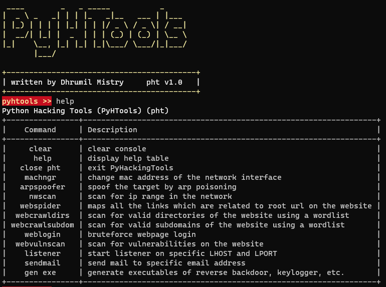

# PyHTools


- Python Hacking Tools (PyHTools) (pht) is a collection of python written hacking tools consisting of network scanner, arp spoofer and detector, dns spoofer, code injector, packet sniffer, network jammer, email sender, downloader, wireless password harvester credential harvester, keylogger, download&execute, and reverse_backdoor along with website login bruteforce, scraper, web spider etc. PHT also includes malwares which are undetectable by the antiviruses.



- The tools provided are for educational purposes only. The developers are no way responsible for misuse of information and tools provided. All the information and tools are meant to help users to learn concepts. Use tools wisely!

- These tools are written in python3, refer installation to install/download tools and its dependencies.

- PyHTools comes with UI, but you can also use command line to use tools individually.

**`NOTE` : The UI hasn't been updated yet with new tools, and evil files so using cli is preferred.**

## How To Videos

- Gain access to remote shell over the Internet using HTTP Backdoor

   [](https://youtu.be/Wg-PiywAqyw)

## Installation

- Open terminal

- Install git package

   ```bash
   sudo apt install git python3 -y
   ```

- clone the repository to your machine

   ```bash
   git clone https://github.com/dmdhrumilmistry/pyhtools.git
   ```

- Change directory

   ```bash
   cd pyhtools
   ```
  
- install requirements

   ```bash
   python3 -m pip install -r requirements.txt
   ```

## Start PHTools

- run pyhtools.py

   ```bash
   python3 -m pyhtools
   ```

- to get all the commands use `help`

   ```bash
   pyhtools >> help
   ```

> There may be chances that pyfiglet or kamene will not be installed through requirements.txt, you can install manually using `pip3 install pyfiglet kamene`.  
> If you're using Termux or windows, then use `pip` instead of `pip3`.  
> Few features are only for linux os, hence they might not work on windows and require admin priviliges.

## Tools and Features

### Attackers

- `For Networks`
  - Network Scanner
  - Mac changer
  - ARP Spoofing
  - DNS spoofing
  - Downloads Replacer
  - Network Jammer
  - Pkt Sniffer
  - Code Injector
- `For Websites`
  - Login Guesser (Login Bruteforcer)
  - Web Spider
  - Web crawler (detects dirs | subdomains)
  - Web Vulnerablity Scanner

### Detectors

- ARP Spoof Detector

### Malwares/Trojans/Payloads/Ransomwares/Worms

- Email Sender (reporter)
- Downloader
- Wireless Password Harvester
- Credential Harvester
- Keylogger (dlogs)
- Reverse Backdoors
  - [TCP](https://github.com/dmdhrumilmistry/pyhtools/tree/main/malwares/reverse_backdoor/TCP)
  - [HTTP](https://github.com/dmdhrumilmistry/pyhtools/tree/main/malwares/reverse_backdoor/HTTP)
- Download and Execute
- [Telegram Data Harvester](https://github.com/dmdhrumilmistry/pyhtools/blob/main/malwares/telegram_data_harvester/HowToUse.md)
- [DMSecRansomware](https://github.com/dmdhrumilmistry/pyhtools/blob/main/ransomwares/dmsec/HowToUse.md)
- [Telegram Remote Code Executor](https://github.com/dmdhrumilmistry/pyhtools/tree/main/malwares/TelegramRemoteCodeExecutor)
- DirCloner

  > **NOTE:** Do not upload/send/report malwares to anti virus services such as `VirusTotal`. This will make program detectable

## Dependencies

   **`PHT`** requires following programs/scripts to run properly -

- `Python`
  - `subprocess`
  - `scapy`
  - `kamene`
  - `pyfiglet`
  - `argparse`
  - `re`
  - `sys`
  - `os`
  - `shutil`
  - `pyinstaller`

   > **NOTE:** most of the modules are pre-installed, still to ensure the proper working of scripts, user should install the required modules using pip

## How to Package a Trojan

- [View How to create a Trojan](https://github.com/dmdhrumilmistry/hacking_tools/blob/master/malwares/Trojans/HowToCreateTrojanPackage.md)

## Have any Ideas 💡 or issue

- Create an issue
- Fork the repo, update script and create a Pull Request

## Connect With Me

||Platforms||
|:-:|:-:|:-:|
|[](https://github.com/dmdhrumilmistry)|[](https://linkedin.com/in/dmdhrumilmistry)|[](https://twitter.com/dmdhrumilmistry)|
|[](https://instagram.com/dmdhrumilmistry/)|[](https://dhrumilmistrywrites.blogspot.com/)|[](https://www.youtube.com/channel/UChbjrRvbzgY3BIomUI55XDQ)|
